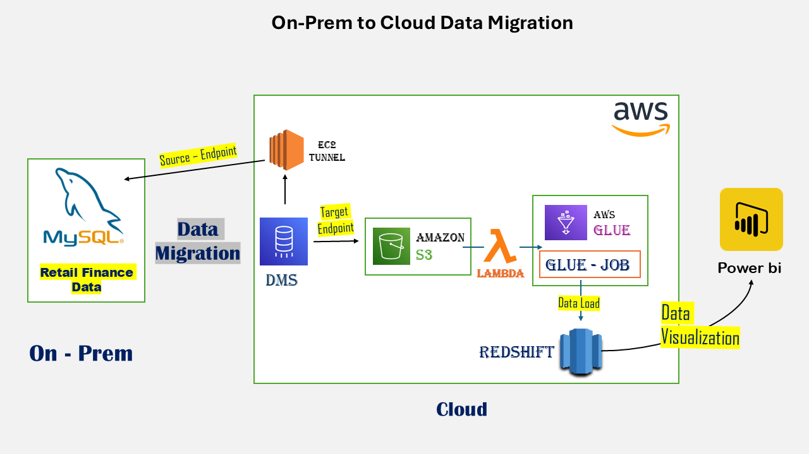
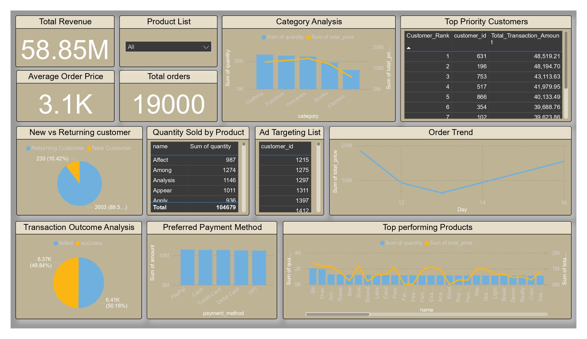

# Retail Finance Data Migration to AWS Cloud

A comprehensive solution for migrating retail finance data from an on-premise MySQL database to AWS, designed to support big data analytics. This project integrates multiple AWS services into an end-to-end pipeline that covers data generation, secure connectivity, migration, transformation, and visualization.

---

## Table of Contents

1. [Architecture Overview](#architecture-overview)
2. [End-to-End Implementation](#end-to-end-implementation)
3. [Challenges Faced](#challenges-faced)
4. [Repository Structure](#repository-structure)
5. [Connect & Collaborate](-#Connect-&-Collaborate)

---

## Architecture Overview

The solution is designed as an end-to-end pipeline that securely connects your on-premise MySQL database to AWS using an EC2 SSH tunnel, migrates data via AWS DMS, transforms and cleanses data using AWS Glue, and automates loading into Redshift with AWS Lambda. For a visual overview, please refer to the diagram below:

---

## End-to-End Implementation

The project’s implementation is divided into clear, sequential steps:

1. **Data Generation:**
   - Use [setup_mock_financial_data.py](./setup_mock_financial_data.py) and [daily_mock_retail_data.py](./daily_mock_retail_data.py) to generate realistic retail finance data.
   - Insert the generated data into an on-premise MySQL database.

2. **Establishing Secure Connectivity:**
   - Configure an EC2 instance to create an SSH tunnel, forwarding the on-premise MySQL port (3306/3307) to a reachable endpoint in AWS.
   - This setup enables secure connectivity between AWS services and my on-premise database.

3. **Data Migration with AWS DMS:**
   - Deploy a DMS replication instance.
   - Configure the source (on-premise MySQL) and target (S3 data lake) endpoints.
   - Run the DMS task for a full load and continuous CDC, storing data in Parquet format.

4. **Data Transformation and Loading into Redshift:**
   - Execute an AWS Glue job ([glu_job_script](./glu_job_script)) to cleanse the migrated data (e.g., removing CDC markers) and Load the cleansed data into Amazon Redshift with job bookmarks ensuring only new         data is processed.
  [redshift-load-glue-job-diagram](redshift-load-glue-job.jpg),

5. **Automation and Triggering:**
   - Deploy the [lambda_function](./lambda_function.py) to trigger the Glue job upon new data arrival in the S3 bucket.

### Visualization

- I provided data analyst Vikas with the necessary access by creating a dedicated user and assigning the required permissions on Redshift. This setup enables him to perform visualization on Power BI. 
- Below is a snapshot of the dashboards he developed.

For more details on how he builds interactive dashboards and analyzes the stored Redshift data, please refer to his repository or LinkedIn profile.
  
LinkedIn: [Vikas Kumar](https://www.linkedin.com/in/vikas-singh00/) | Repository: [github://vikas-visualization](github://vikas-visualization)

---

## Challenges Faced

Several key challenges were addressed during the project implementation:

- **Secure Remote Connectivity:**  
  Overcoming ISP restrictions required setting up an EC2 SSH tunnel to securely forward the on-premise MySQL port.

- **Handling CDC Data:**  
  Ensuring the accurate capture and incremental loading of change data while preserving data integrity was complex.

- **Data Format Issues:**  
  Transitioning from CSV to Parquet format resolved issues with data corruption (e.g., misinterpreted commas) and preserved data types.

- **AWS Service Integration:**  
  Integrating AWS DMS, Glue, Lambda, and Redshift involved careful configuration of endpoints, security groups, and permissions.

- **Incremental Loading:**  
  Effectively implementing Glue job bookmarks to avoid data duplication and ensure only new data is processed demanded thorough testing.

---

## Repository Structure

This repository includes the following key files and directories:

- **Data Generation & Setup:**
  - [daily_mock_retail_data.py](./daily_mock_retail_data.py)  
    *Generates daily mock retail finance data.*
  - [setup_mock_financial_data.py](./setup_mock_financial_data.py)  
    *Initial script for setting up and populating the MySQL database with mock data.*

- **AWS Migration & Transformation:**
  - [redshift-sql-script](./redshift-sql-script.txt)  
    *SQL script for setting up the Redshift schema.*
  - [glu_job_script](./glu_job_script.py)  
    *AWS Glue job script for data cleansing, transformation and loading data into Redshift.*
  - [lambda_function](./lambda_function.py)  
    *Lambda function code to trigger the Glue job on new S3 object events.*

- **Architecture Diagrams:**
  - [architecture](./architecture.png)  
    *Overall architecture diagram of the solution.*
  - [Glue_job_architecture](./Glue_job_architecture.jpg)  
    *Diagram illustrating the AWS Glue job architecture.*

- **Dependencies:**
  - [requirements.txt](./requirements.txt)  
    *List of required Python packages.*

---

## Connect & Collaborate

Thank you for taking the time to review the documentation for our retail finance data migration pipeline. Your feedback and ideas are essential to refining this project. If you have suggestions or improvements, please feel free to share your thoughts.

You can reach out to me directly via email at [shahbajcse@gmail.com](mailto:shahbajcse@gmail.com) or connect with me on [LinkedIn](https://www.linkedin.com/in/mdshahbaj/)

Additionally, if you'd like to connect with our data analyst, Vikas—who handled the complete visualization—please check out his profiles:
- **LinkedIn:** [Vikas Kumar](https://www.linkedin.com/in/vikas-singh00/)
- **Repository:** [github://vikas-visualization](github://vikas-visualization)

Thank you and happy collaborating!
